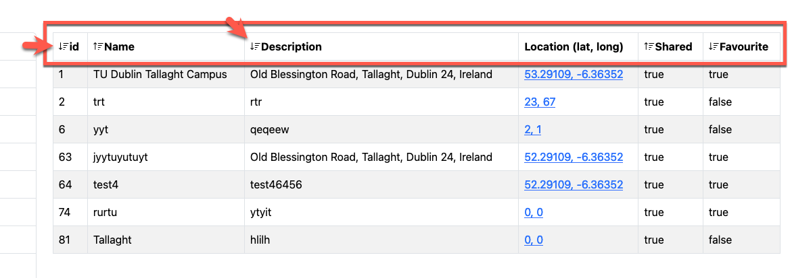
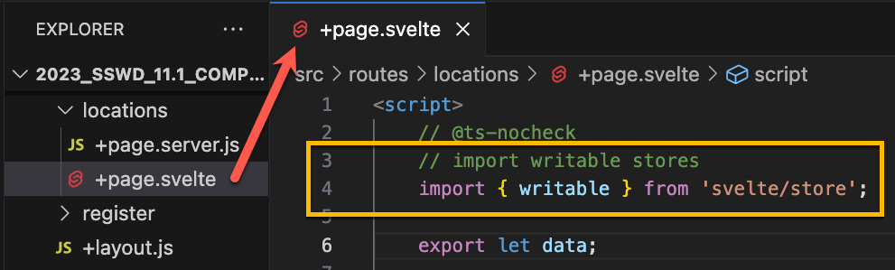
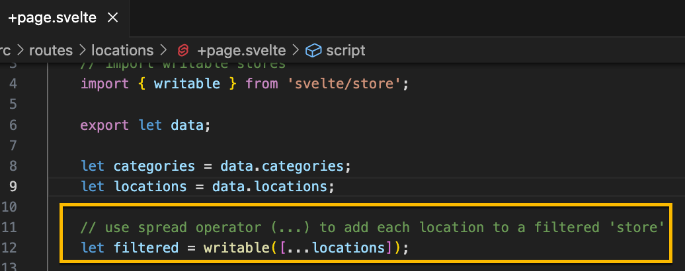
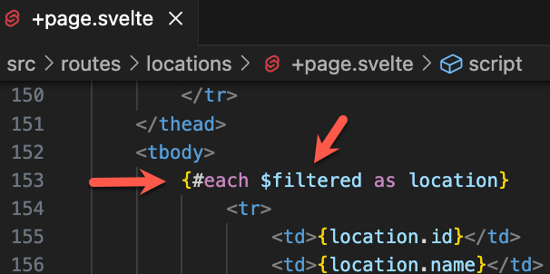
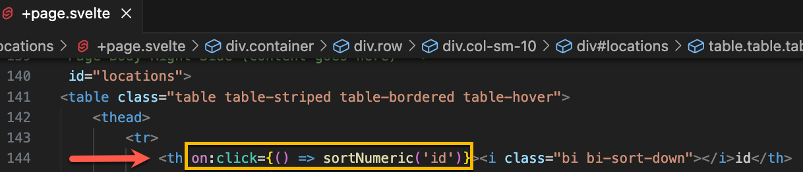

# Lab 11 - Sorting the table

Enda Lee 2023

### Quick Start

1. Download the start site from this repository and extract it to a folder named `lab10`.
2. Open the `lab10` **folder** in VS Code.
3. In a terminal run `npm install`.
4. Start the application using `npm run dev`.

This repository includes solution to the previous lab exercises. 

**You will need to add `.env` (base it on `.env.example`) and set your API keys, etc.**


## Introduction

This lab adds a table sorting so that each column can be clicked to sort up or down. This will be implemeted client-side so that the existing data can be used.

The example will use Svelte Stores, which are usually used to persist data across requests and between components, but are also sortable and reactive so that changes cause page updates. See https://bigi.dev/blog/2020-08-26-svelte-reactivity-and-stores/ for more.

The data will be sorted using standard JavaScrit Array sort functions, e.g https://www.javascripttutorial.net/javascript-array-sort/



## 1. Setting up - switch to using A Svelte Store for locations

Everything here will be client-side, in the **locations page**. Open **`src/routes/locations/+page.svelte`** for editing in VS Code.

1. The first step is to import `writeable` from `svelte/sore` at the start of the `<script>` section



2. Next, add the list of locations to the store, from the `locations` aray. The JavaScript **spread** operator `...array` makes this easy. Add the code below to make the `filtered` store `wrtitable` and add each `location`.

   


3. Modify the `#each` loop to use `$filtered` instead of `locations`. This is where location rows are added to the table. Note, the `$`.

   

   

No try the page, it should work as before.


## 2. The Sort Functions

Next, add functions to perform the sort. These should be added to the `<script>` section of **`src/routes/locations/+page.svelte`**.


#### 2.1. Keeping track of sort direction

We will be sorting most of the columns and so need to keep track of the sort state for each (e.g. ascending or descending). A JS Object named `table_sort` will be used for this. Add it to the `<script>` section:

```javascript
	//  keep track of sort directions for each col
	const table_sort = {
		id: false,
		name: false,
		description: false,
		shared: false,
		favourite: false
	};
```


#### 2.2. Sorting Alphabetic columns.

These include names, descriptions, etc.

* The `col` param defines which table column should be sorted. This should also be defined in `table_sort` above.
*  The column state in `table_sort`  is changed.
* JavaScript `array sort` is used to sort asc. or desc.

Add this function to the page. 

```javascript
	// Sort alpha values in a given column
	function sortAlpha(col) {
		// reverse current sort direction for this col
		// i.e. reverse the current order
		table_sort[col] = !table_sort[col];

		// output to the  browser console
		console.log(`${col} : ${table_sort[col]}`);

		// sort the products array based on column selected
		// sort takes a function parameter to indicate which column should be sorted
		$filtered = $filtered.sort((a, b) => {
			// sort asc
			if (table_sort[col] === true) {
				return a[col].toLowerCase() < b[col].toLowerCase();
				// sort desc
			} else {
				return a[col].toLowerCase() > b[col].toLowerCase();
			}
		});
	};

```


#### 2.3. Sorting Numeric and Boolean columns.

The process is similiar to above but a seperate function is required as the JavaScript method for sorting numbers is different. Add the following function to the page. Read the comments for details.

```javascript
	// sort numeric and boolean values in a given column
	function sortNumeric(col) {
		// reverse current sort direction for this col
		table_sort[col] = !table_sort[col];

		// check browser console for output
		// sort takes a function parameter to indicate which column should be sorted
		console.log(`${col} : ${table_sort[col]}`);

		// sort the products array based on column selected
		$filtered = $filtered.sort((a, b) => {
			if (table_sort[col] === true) {
				return a[col] - b[col];
			} else {
				return b[col] - a[col];
			}
		});
	};
```


## 3. Calling the sort functions

The functions should be called when one of the table headers is clicked, e.g. **id**:




## 4. Exercises

1. Make the id, name, description, shared, and favourite colums sortable.
1. Add suitable sort icons from [Bootstrap Icons](https://icons.getbootstrap.com/).
1. Use a function to change the icon in order to show the correct sort direction.


------

Enda Lee 2023
